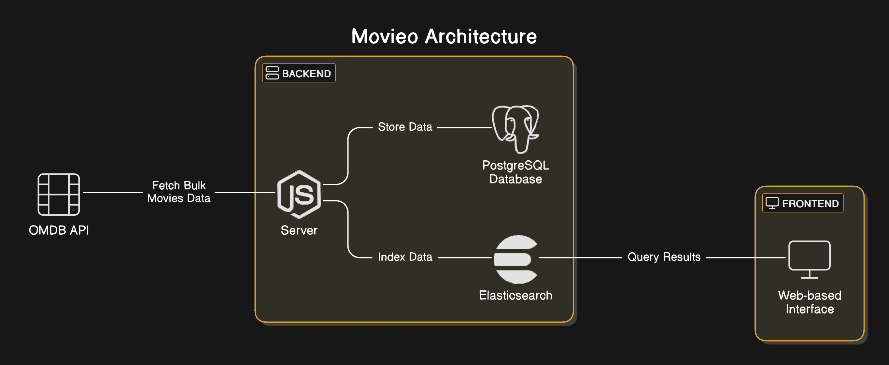

# Architecture Design Decisions for Movieo

## Overview

Movieo is a full-stack application designed to fetch and search movies efficiently. It integrates a **React TypeScript frontend**, a **Node.js TypeScript backend**, **PostgreSQL for structured data**, and **Elasticsearch for full-text search**.

## Architecture Diagram

## Design Decisions

### 1. **Frontend (React + TypeScript + Vite)**

- Uses **Vite** for fast development builds.
- Implements a **Masonry Grid** and **Virtualized List** for optimized rendering.
- Fetches data from the **backend API**.
- Uses **debounced search** for a smooth user experience.
- Built with **Docker** for containerized deployment.

### 2. **Backend (Node.js + Express + TypeScript + Prisma)**

- **Express.js API** with routes for fetching and searching movies.
- **Prisma ORM** for database interactions.
- Fetches movies from **OMDB API**, storing them in **PostgreSQL**.
- Uses **Elasticsearch** for efficient movie searches.
- Structured as **Clean Architecture**, with `core/domain`, `controllers`, `services`, and `routes`.

### 3. **Database (PostgreSQL)**

- Stores **structured movie data**.
- Managed via **Prisma ORM** for schema migrations and queries.
- Runs as a **Docker container**.

### 4. **Search Engine (Elasticsearch)**

- Provides **fast full-text search** capabilities.
- Uses **indexing** for storing movies.
- Queries are optimized with **multi-match search**.
- Runs in a **single-node mode** inside Docker.

### 5. **OMDB API Integration**

- Used to fetch **movie details**.
- Data is first retrieved, then indexed into PostgreSQL & Elasticsearch.

## Deployment Strategy

- Uses **Docker Compose** to orchestrate services.
